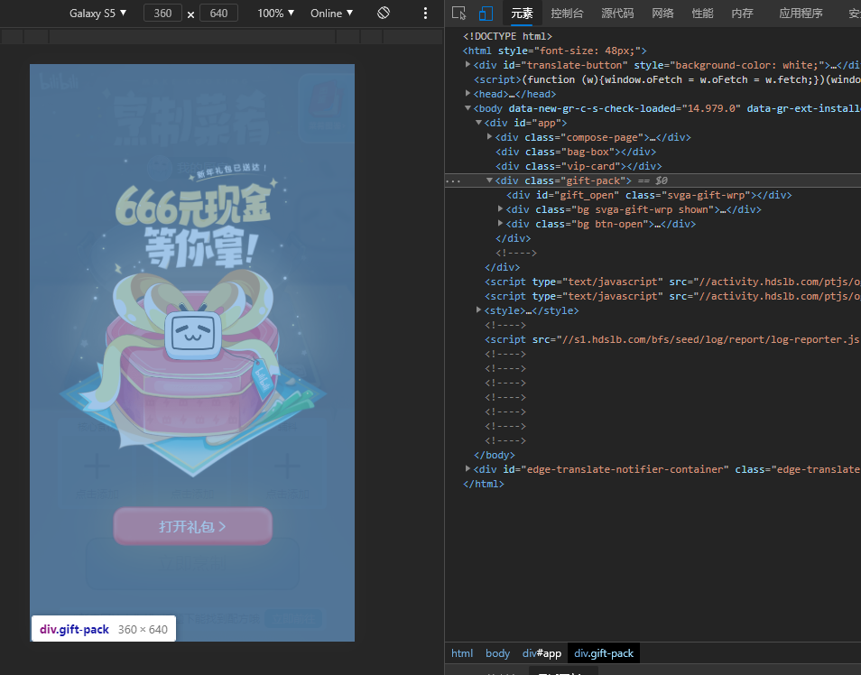

由于不想搞账号密码等较为复杂的方法，采用复制页面json

链接 https://www.bilibili.com/blackboard/activity-yeGIPr7OX.html?from=native&share_medium=android&share_plat=android&share_source=QQ&share_tag=s_i&timestamp=1612692228&unique_k=EFDQTP#

打开F12  同时设置页面为手机
将该区块设为 display：none

打开浏览器的网络请求 选择xhr类型的

复制dishes的值到have.txt中,即可

然后直接点烹制，里面会有请求获得核心配料和辅料的。

复制上图中的assist_ingredients的值到ingredient.txt

复制上图中的core_ingredients的值到core.txt

有用的给个助力？有问题看到了就回复
https://www.bilibili.com/blackboard/activity-Z-v-4R3hH.html?btoken=4f4b9291fcbc0303e38031116a371dee%2F23504225&ts=1612874453065
